---

---
## Ringkasan Eksekutif

Dokumen ini menyajikan perencanaan, desain, dan strategi implementasi untuk **Sistem Informasi E‑Teller Bank Mini Sekolah**, yaitu aplikasi **client-server** yang mendukung operasional loket bank mini di sekolah untuk transaksi tabungan siswa (**setoran** dan **penarikan tunai**). Sistem menerapkan **kontrol akses berbasis peran (RBAC)** melalui satu login terpusat untuk Administrator, Piket Teller, Supervisor, dan Nasabah/Siswa, serta memastikan setiap transaksi otomatis tercatat dalam **jurnal akuntansi double-entry** (Debet Kas 101 dan Kredit Tabungan 201) yang selalu seimbang. Dokumen ini disusun dengan fokus pada aturan bisnis kunci (saldo mengendap minimum Rp10.000, penutupan kas harian, pembatasan hak akses) dan constraint database (FK ON DELETE RESTRICT, CHECK nominal > 0), sehingga siap digunakan sebagai laporan resmi UKK.

# BAGIAN 1 — Perencanaan Sistem (System Planning)

## 1. Ruang Lingkup Proyek (Project Scope)

### 1.1 Tujuan Proyek (Goals)

1. Menyediakan sistem terpusat untuk melayani transaksi tabungan siswa berupa **setoran tunai** dan **penarikan tunai** di loket bank mini sekolah.
2. Menerapkan **RBAC** untuk memastikan setiap peran hanya dapat mengakses fitur sesuai kewenangan:
    - Administrator: manajemen user, pembuatan rekening nasabah otomatis, konfigurasi, audit jurnal (read-only).
    - Piket Teller: pencarian nasabah (QR/manual), input transaksi, cetak draft laporan harian.
    - Supervisor: verifikasi & approve laporan harian, otorisasi pemindahan kas, penyelesaian selisih.
    - Nasabah/Siswa: cek saldo dan mutasi (read-only), input PIN 6 digit saat konfirmasi penarikan.
3. Menjamin setiap transaksi menghasilkan **pencatatan jurnal akuntansi double-entry** yang **balance**.
4. Mendukung proses **penutupan kas harian** dan penguncian (lock) cetak laporan bila terjadi selisih antara perhitungan sistem dan uang fisik.

### 1.2 Batasan Sistem (In-Scope vs Out-of-Scope)

- Aplikasi **web client** (browser) dan **backend API/server** yang terhubung ke database.
- Login terpusat dengan pembatasan akses berdasarkan role (RBAC).
- Fitur Administrator:
    - CRUD akun petugas (admin/teller/supervisor) sesuai kebijakan.
    - Pembuatan nomor rekening nasabah otomatis.
    - Konfigurasi sistem dasar (mis. saldo minimum Rp10.000, pengaturan QR scanner).
    - Audit jurnal akuntansi (read-only).
- Fitur Piket Teller:
    - Pencarian profil nasabah melalui **scan QR** atau input manual nomor rekening.
    - Input transaksi setoran.
    - Input transaksi penarikan dengan **verifikasi PIN 6 digit**.
    - Cetak **draft** laporan harian teller.
    - Transaksi yang sudah tersimpan bersifat **immutable** (tidak dapat diedit/hapus oleh teller).
- Fitur Supervisor:
    - Verifikasi dan **approve** laporan harian teller.
    - Otorisasi pemindahan kas ke brankas.
    - Pencatatan/penyelesaian selisih kas.
- Fitur Nasabah/Siswa:
    - Cek saldo dan melihat riwayat mutasi (read-only).
- Implementasi aturan bisnis dan constraint database sesuai konteks.

- Tidak ada aplikasi mobile native (Android/iOS).
- Tidak terintegrasi dengan payment gateway eksternal, bank eksternal, QRIS, e-wallet, atau sistem keuangan pihak ketiga.
- Tidak mencakup modul pinjaman/kredit, bunga tabungan, atau produk keuangan lain.
- Tidak ada multi-cabang/multi-sekolah; sistem diasumsikan untuk **satu loket bank mini**.
- Tidak ada integrasi perangkat khusus selain kamera/QR scanner standar (tidak mencakup mesin EDC, cash counter otomatis, dsb.).
- Tidak membangun sistem akuntansi lengkap (mis. neraca/laba rugi); fokus pada jurnal transaksi dan laporan harian.

### 1.3 Deliverable Akhir

5. **Aplikasi Web**:
    - Frontend (client) untuk masing-masing role.
    - Backend API (server) dengan RBAC, transaksi, dan jurnal otomatis.
6. **Database**:
    - Skema dan constraint sesuai ERD (users, nasabah, transaksi, jurnal_akuntansi).
    - Data awal (seed) untuk pengujian.
7. **Dokumentasi UKK**:
    - Perencanaan sistem, desain sistem (diagram & tabel), dan strategi implementasi.

## 2. Jadwal Proyek (Project Schedule)

### 2.1 Tabel Jadwal (16–24 jam)

| **Fase** | **Aktivitas** | **Estimasi Waktu** | **Output** |
| --- | --- | --- | --- |
| Perencanaan & Desain | Identifikasi kebutuhan, batasan, dan rancangan diagram (use case, activity, sequence, class, deployment); finalisasi aturan bisnis | 3 jam | Dokumen desain awal + daftar requirement |
| Setup Environment & Database | Setup server lokal, pembuatan database dan tabel, FK ON DELETE RESTRICT, CHECK nominal > 0, seed data | 3 jam | Database siap pakai + data uji |
| Implementasi Backend (Auth/RBAC) | Login terpusat, hashing password, session/token, middleware RBAC, pembatasan akses per role | 4 jam | Endpoint auth + guard RBAC |
| Implementasi Backend (Transaksi & Jurnal) | Setoran, penarikan (cek saldo minimum Rp10.000 + PIN 6 digit), generate jurnal double-entry (Kas 101/Tabungan 201), penguncian transaksi | 6 jam | Endpoint transaksi + jurnal otomatis |
| Implementasi Frontend | UI Login, Dashboard Teller, Dashboard Supervisor, Dashboard Nasabah; integrasi QR/manual; cetak draft laporan | 5 jam | UI per role berfungsi end-to-end |
| Testing | Unit test logika saldo & validasi, integrasi transaksi-jurnal, uji bypass RBAC, uji skenario selisih kas | 2 jam | Hasil uji + perbaikan bug utama |
| Dokumentasi & Finalisasi | Rapikan laporan UKK, screenshot (bila diperlukan), cek konsistensi aturan bisnis dan constraint DB | 1–2 jam | Dokumen final + paket proyek |

### 2.2 Gantt Chart (Mermaid)

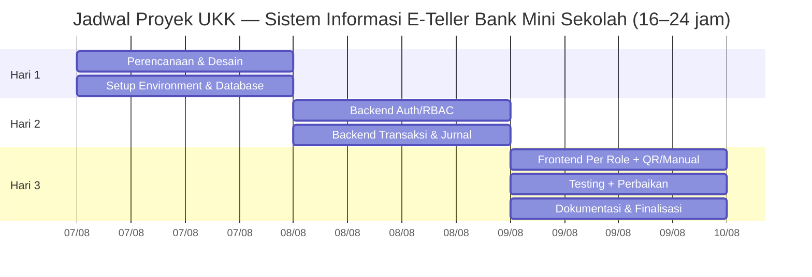

> Catatan: tanggal pada Gantt bersifat contoh untuk visualisasi. Implementasi aktual mengikuti alokasi 16–24 jam.

# BAGIAN 2 — Desain Sistem (System Design)

## A. Functional Requirements

### 1. Daftar Aktor

| **Nama Aktor** | **Deskripsi Singkat** | **Hak Akses Utama** |
| --- | --- | --- |
| Administrator | Petugas yang mengelola user dan konfigurasi sistem, serta audit jurnal. | Kelola akun user; buat nomor rekening nasabah otomatis; konfigurasi saldo minimum & QR scanner; audit jurnal (read-only). Tidak boleh input transaksi. |
| Piket Teller | Petugas loket yang melayani setoran/penarikan dan menyiapkan laporan harian. | Cari nasabah (QR/manual); input setoran; input penarikan + verifikasi PIN; cetak draft laporan harian. Tidak boleh edit/hapus transaksi tersimpan dan tidak boleh approve laporan sendiri. |
| Supervisor / Kepala Bank Mini | Pihak yang memverifikasi laporan harian teller dan mengelola penutupan kas. | Verifikasi & approve laporan harian; otorisasi pemindahan kas; penyelesaian selisih kas. Tidak boleh melayani transaksi langsung. |
| Nasabah / Siswa | Pemilik rekening tabungan yang dapat memantau saldo dan riwayat. | Cek saldo (read-only); lihat mutasi; input PIN 6 digit saat konfirmasi penarikan di depan teller. |

### 2. Use Case Diagram (Mermaid)

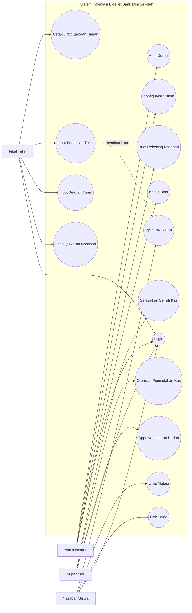

### 3. Activity Diagram

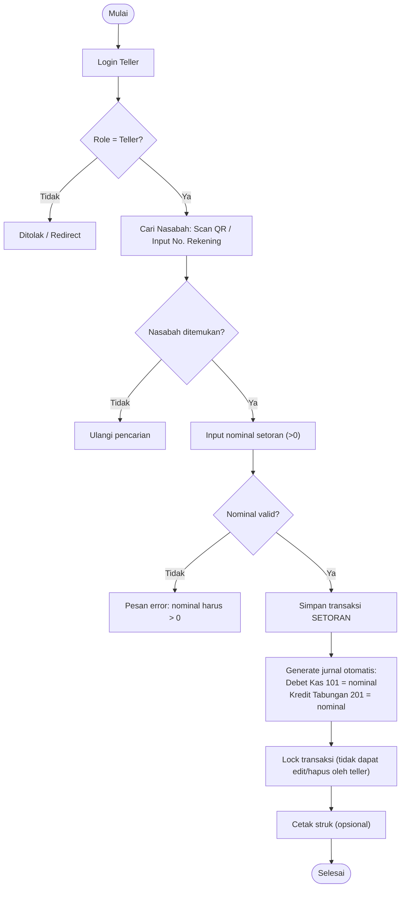

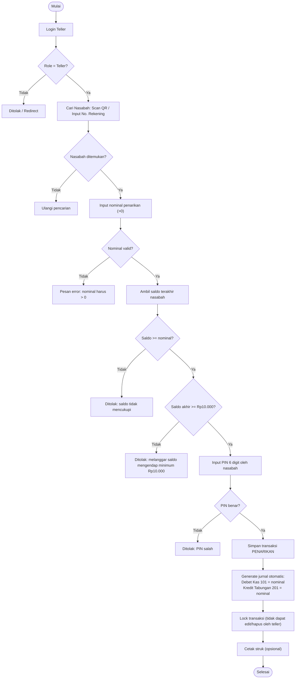

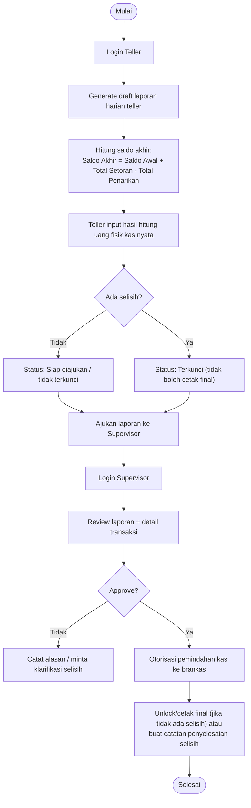

### 4. Sequence Diagram

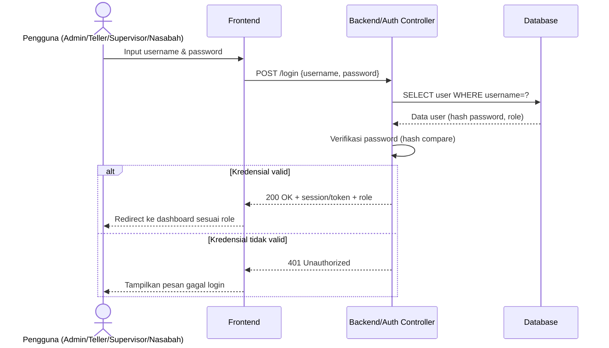

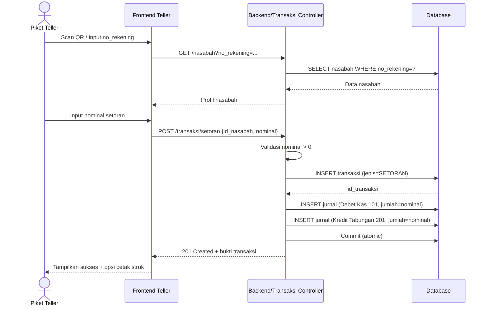

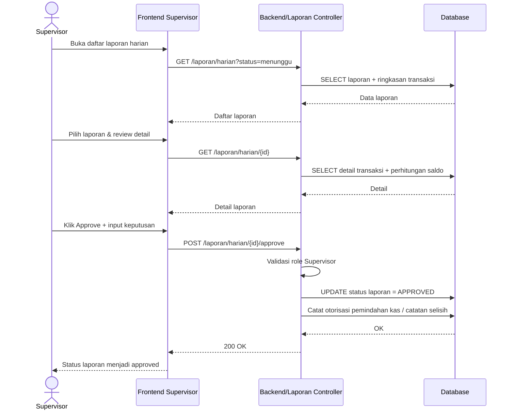

### 5. Class Diagram

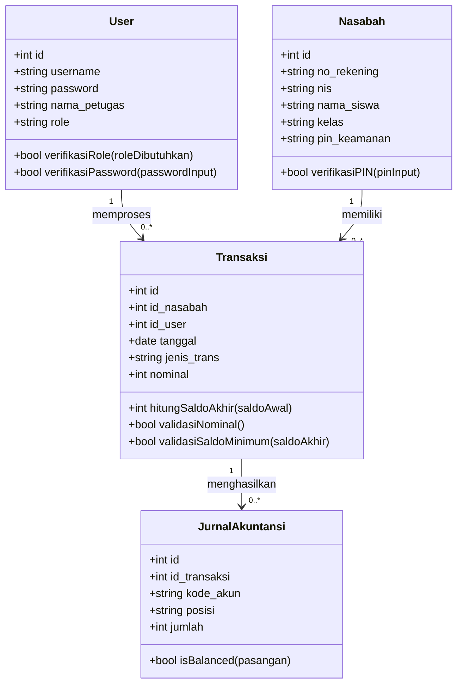

### 6. Data Model / Entity Relationship (ERD)

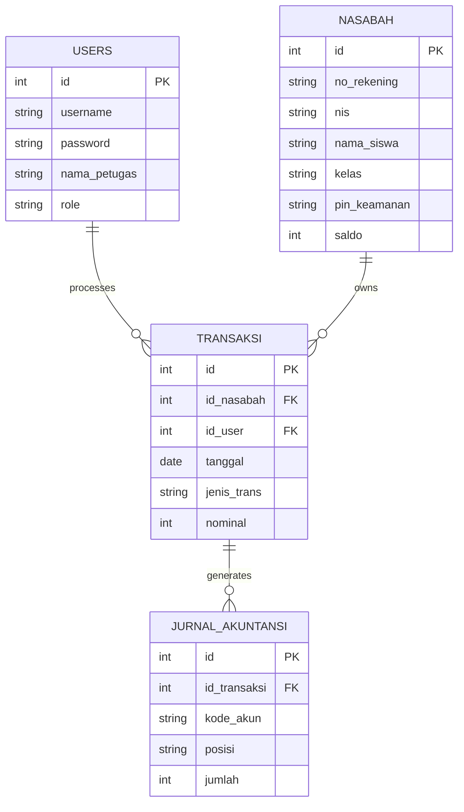

### 7. User Interface Design (Wireframe Deskriptif)

- Komponen:
    - Field: Username
    - Field: Password
    - Tombol: Masuk
    - Pesan error validasi (username/password salah)
- Perilaku:
    - Setelah berhasil login, sistem membaca **role** dan redirect ke dashboard sesuai role.

- Bagian header:
    - Identitas petugas (nama_petugas)
    - Tombol logout
- Panel pencarian nasabah:
    - Tombol/area **Scan QR** (kamera)
    - Input manual **No. Rekening** + tombol cari
    - Hasil profil nasabah: Nama, Kelas, No. Rekening, Saldo terkini (read-only)
- Tab/section transaksi:
    - **Form Setoran**:
        - Input nominal
        - Tombol simpan
        - Output: notifikasi sukses + opsi cetak struk
    - **Form Penarikan**:
        - Input nominal
        - Input PIN 6 digit (diinput oleh nasabah)
        - Notifikasi rule: saldo minimum Rp10.000
        - Tombol simpan
- Panel laporan harian:
    - Tombol generate draft laporan harian
    - Input kas fisik (untuk cek selisih)
    - Status laporan: menunggu/terkunci/siap diajukan

- Daftar laporan harian:
    - Filter status: menunggu, approved, selisih
    - Ringkasan: teller, tanggal, total setoran, total penarikan, saldo akhir, status selisih
- Detail laporan:
    - Tabel transaksi hari itu
    - Rekap perhitungan saldo akhir
    - Kolom catatan selisih/penyelesaian
- Aksi supervisor:
    - Tombol Approve
    - Tombol Tolak/Minta klarifikasi
    - Opsi otorisasi pemindahan kas ke brankas

- Ringkasan akun:
    - Nama siswa, Kelas, No. Rekening
    - Saldo saat ini (read-only)
- Riwayat mutasi:
    - Filter tanggal
    - Daftar transaksi: tanggal, jenis (setoran/penarikan), nominal
- Catatan keamanan:
    - PIN tidak dapat ditampilkan; PIN hanya digunakan saat konfirmasi penarikan.

### 8. Deployment Diagram (Mermaid)

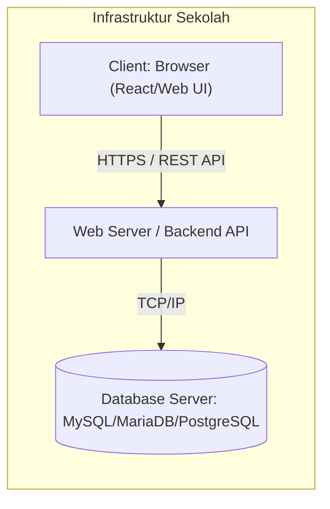

### 9. Matriks Relasi

| **Aktor** | **Activity: Setoran Tunai** | **Activity: Penarikan Tunai** | **Activity: Penutupan Kas & Laporan Harian** |
| --- | --- | --- | --- |
| Administrator | Tidak — tidak melayani transaksi | Tidak — tidak melayani transaksi | Tidak — bukan pihak approval |
| Piket Teller | Ya — input setoran & simpan transaksi | Ya — input penarikan & verifikasi PIN | Ya — generate draft & input kas fisik |
| Supervisor | Tidak — tidak melayani transaksi | Tidak — tidak melayani transaksi | Ya — review, approve, otorisasi pemindahan kas, selesaikan selisih |
| Nasabah/Siswa | Tidak — tidak input transaksi | Ya (terbatas) — input PIN saat penarikan | Tidak |

| **Aktor** | **Sequence: Login & Autentikasi Role** | **Sequence: Proses Setoran Tunai** | **Sequence: Approval Laporan Harian** |
| --- | --- | --- | --- |
| Administrator | Ya — login untuk akses fitur admin | Tidak | Tidak |
| Piket Teller | Ya — login untuk akses dashboard teller | Ya — aktor utama transaksi setoran | Tidak |
| Supervisor | Ya — login untuk akses dashboard supervisor | Tidak | Ya — aktor utama approval |
| Nasabah/Siswa | Ya — login untuk cek saldo/mutasi | Tidak | Tidak |

## B. Non-Functional Requirements

| **Kategori** | **Deskripsi Kebutuhan** | **Target/Kriteria Ukur** |
| --- | --- | --- |
| Operasional | Sistem mendukung jam operasional loket bank mini sekolah dan penggunaan oleh petugas terkait. | Jam layanan mengikuti jadwal sekolah (mis. Senin–Jumat). Pengguna bersamaan realistis: 1 teller aktif, 1 supervisor, 1 admin (tidak selalu bersamaan), beberapa nasabah untuk cek saldo. |
| Performa | Respon sistem cukup cepat untuk pelayanan loket. | Respon transaksi (setoran/penarikan) ≤ 2 detik (kondisi normal). Query laporan harian ≤ 3 detik untuk data 1 hari. |
| Keamanan | Proteksi autentikasi dan otorisasi; validasi input; keamanan PIN. | Password disimpan dalam bentuk hash (bcrypt/password_hash). PIN 6 digit diverifikasi, tidak ditampilkan. Middleware RBAC mencegah akses URL lintas role. Validasi server-side untuk nominal > 0. Proteksi SQL injection (prepared statement/ORM). Session/token memiliki expiry (mis. 1–8 jam) dan logout menghapus session. |
| Perangkat Keras | Spesifikasi minimum perangkat loket. | Minimal Core i3, RAM 4 GB (8 GB direkomendasikan), storage cukup untuk server lokal. Kamera/webcam atau QR scanner untuk membaca kartu siswa. |
| Platform Deployment | Opsi penempatan aplikasi sesuai konteks sekolah. | **Local server sekolah**: mudah offline, kontrol penuh, perlu maintenance. **Shared hosting**: murah, terbatas kontrol & performa. **VPS**: fleksibel & stabil, perlu kemampuan administrasi. Untuk UKK, disarankan local server (XAMPP/Laragon/Docker) agar mudah demo. |
| Batas Waktu | Pengerjaan proyek individu dengan deadline UKK. | Total pengembangan 16–24 jam. Prioritas: database constraint, RBAC, transaksi + jurnal otomatis, penutupan kas & approval. |

# BAGIAN 3 — Implementasi Sistem (System Implementation)

## Strategi Implementasi Sistem

### 1. Strategi Pengujian (Testing Strategy)

8. **Unit Testing**
    - Target: fungsi logika bisnis yang bersifat deterministik.
    - Contoh:
        - Fungsi validasi nominal (>0).
        - Fungsi validasi saldo minimum Rp10.000.
        - Fungsi perhitungan saldo akhir penutupan kas.
9. **Integration Testing**
    - Target: alur lintas komponen (frontend/backend/database) untuk transaksi dan jurnal.
    - Contoh:
        - Setoran: input → transaksi tersimpan → dua jurnal tercatat dan balance.
        - Penarikan: cek saldo → cek saldo minimum → PIN → transaksi & jurnal.
10. **User Acceptance Testing (UAT)**
    - Target: skenario penggunaan berdasarkan role.
    - Contoh:
        - Teller dapat input transaksi namun tidak dapat edit/hapus transaksi tersimpan.
        - Nasabah tidak dapat mengakses URL dashboard teller.
        - Supervisor dapat approve laporan, teller tidak dapat approve laporan sendiri.

| **ID Test Case** | **Skenario** | **Input** | **Expected Output** | **Status** |
| --- | --- | --- | --- | --- |
| TC-01 | Penarikan melebihi saldo | Saldo nasabah: Rp50.000, nominal tarik: Rp80.000 | Transaksi ditolak, pesan “saldo tidak mencukupi”, tidak ada transaksi/jurnal tercatat | Belum diuji |
| TC-02 | Penarikan membuat saldo di bawah Rp10.000 | Saldo: Rp15.000, tarik: Rp10.000 | Ditolak karena saldo akhir Rp5.000 < Rp10.000, tidak ada transaksi/jurnal tercatat | Belum diuji |
| TC-03 | Role Nasabah mencoba akses URL Teller | Login sebagai nasabah, akses /teller/dashboard | Redirect ke halaman tidak berwenang/403, tidak ada data sensitif terbuka | Belum diuji |
| TC-04 | Double-entry jurnal balance check | Setoran Rp100.000 | Terbentuk 2 baris jurnal: Debet Kas 101 Rp100.000 dan Kredit Tabungan 201 Rp100.000; total debet = total kredit | Belum diuji |
| TC-05 | Input nominal negatif ditolak | Nominal: -5000 | Validasi gagal, pesan “nominal harus > 0”, tidak ada transaksi/jurnal tersimpan | Belum diuji |

### 2. Strategi Instalasi (Installation Strategy)

- Disarankan menggunakan **Direct Cutover** untuk konteks UKK sekolah, karena:
    1. Sistem biasanya didemokan pada satu sesi uji/penilaian.
    2. Ruang lingkup terbatas (loket mini bank), sehingga lebih sederhana dan cepat.
    3. Mengurangi kompleksitas menjalankan dua sistem sekaligus.

11. **Persiapan perangkat**
    - 1 PC/laptop loket (minimal Core i3, RAM 4 GB; 8 GB direkomendasikan).
    - Kamera/webcam atau QR scanner.
12. **Setup server aplikasi**
    - Instal XAMPP/Laragon/Docker sesuai stack.
    - Konfigurasi port dan virtual host (bila diperlukan).
13. **Setup database**
    - Buat database (mis. `bank_mini`).
    - Jalankan script migrasi untuk membuat tabel: users, nasabah, transaksi, jurnal_akuntansi.
    - Pastikan constraint aktif: FK ON DELETE RESTRICT; CHECK nominal > 0.
14. **Konfigurasi environment**
    - Isi file konfigurasi (.env) untuk koneksi DB, secret key, expiry session/token.
    - Set parameter saldo minimum = Rp10.000.
15. **Seed data**
    - Buat akun admin, teller, supervisor.
    - Buat beberapa nasabah untuk demo.
16. **Uji smoke test**
    - Login per role.
    - Uji 1 setoran dan pastikan jurnal tercatat.
    - Uji 1 penarikan (valid dan invalid).
17. **Go-live untuk demo/UKK**
    - Jalankan server backend dan frontend.
    - Pastikan akses dari browser di perangkat loket.

### 3. Strategi Manajemen Perubahan (Change Management Strategy)

- **Teller (±15–30 menit)**
    - Cara login.
    - Cara scan QR / input manual rekening.
    - Cara input setoran dan penarikan + proses input PIN oleh nasabah.
    - Cara generate draft laporan harian.
    - Batasan: transaksi tersimpan tidak bisa diubah.
- **Supervisor (±15–30 menit)**
    - Cara melihat daftar laporan harian.
    - Cara review detail dan approve.
    - Cara mencatat penyelesaian selisih dan otorisasi pemindahan kas.

- Manual ringkas per role (1–2 halaman):
    - Admin: kelola akun, buat rekening nasabah, konfigurasi, audit jurnal.
    - Teller: transaksi setoran/penarikan, cetak draft laporan.
    - Supervisor: approval laporan, selisih kas, otorisasi brankas.
    - Nasabah: cek saldo & mutasi.

- **Backup**
    - Backup database harian (dump SQL) sebelum demo/ujian.
    - Simpan file backup di media terpisah (flashdisk/drive).
- **Rollback**
    - Jika terjadi kegagalan data saat instalasi/demo, lakukan restore dari backup terakhir.
    - Untuk error aplikasi, siapkan rilis stabil sebelumnya (folder aplikasi cadangan) untuk dijalankan kembali.

# Lampiran — Stack Teknis (Diisi Sesuai Implementasi)

> Isi bagian ini sesuai stack yang dipilih saat pengembangan:

- Stack teknis: **[ISI DI SINI]** (contoh: “Laravel 11 (Backend API) + React (Frontend) + MySQL (Database)”).
- Arsitektur: Client (Browser) ↔ Backend API ↔ Database.
- Catatan dependensi tambahan: library QR scanner, library cetak/PDF/receipt.
