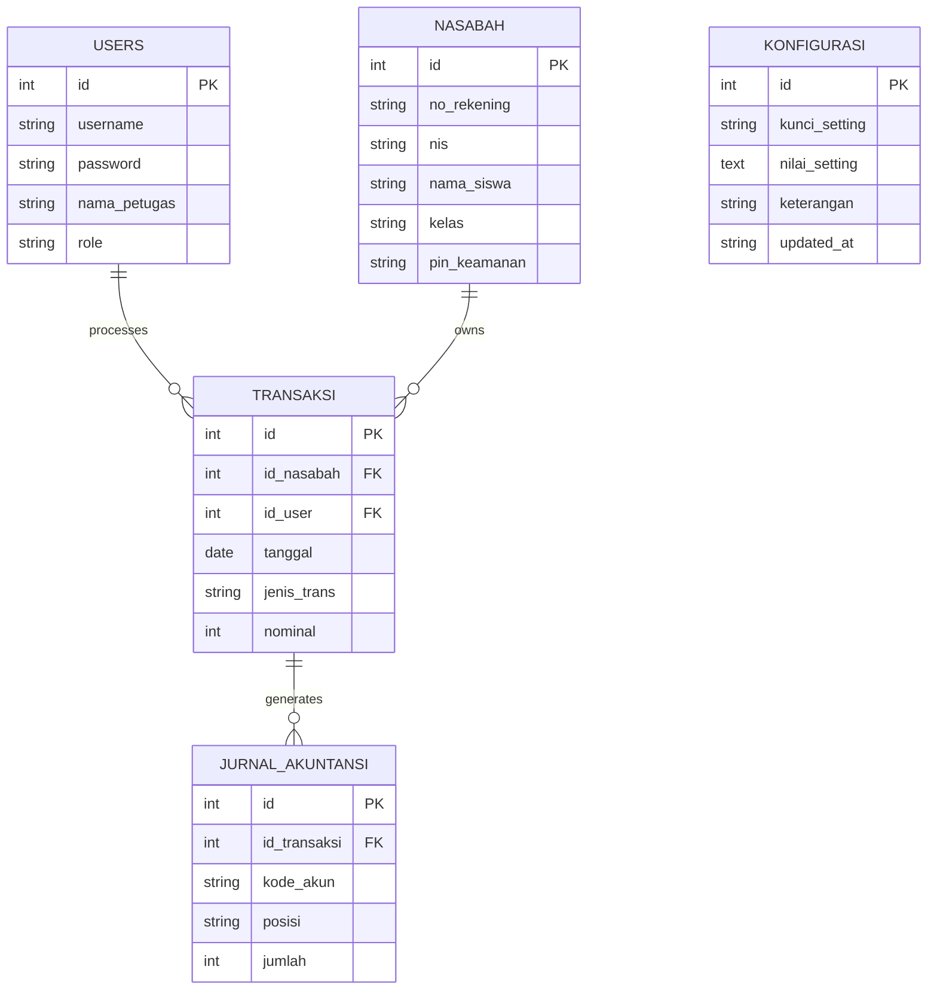
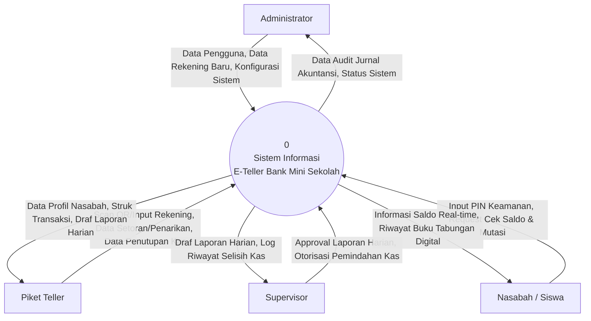

As Lead Software Architect for the **School Mini Bank E-Teller System** UKK project, this plan sequences the build across 5 phases, provides a Kanban-style task backlog, a 3-day / 16–24 hour execution timeline, and the environment prerequisites — all weighted toward the evaluation rubric (Database 25%, Business Rules 40%, Security & RBAC 35%).

# I. Phase-by-Phase Development Plan

## Database Schema Reference

| **Table** | **Key Fields** | **Relations** |
| --- | --- | --- |
| users | id (PK), username, password, nama_petugas, role (enum) | 1 → M transaksi |
| nasabah | id (PK), no_rekening, nis, nama_siswa, kelas, pin_keamanan | 1 → M transaksi |
| transaksi | id (PK), id_nasabah (FK), id_user (FK), tanggal, jenis_trans (enum), nominal | 1 → M jurnal_akuntansi |
| jurnal_akuntansi | id (PK), id_transaksi (FK), kode_akun, posisi (enum), jumlah | Belongs to transaksi |

## Phase 1 — Architecture & Database Setup

Estimated: **4 hours** · Rubric focus: Database Constraints (25%)

| **Task** | **Est. Hours** | **DB Design / Detail** |
| --- | --- | --- |
| Design ERD & finalize 3NF schema | 1.0 | No duplicate data; confirm PK/FK relationships across all 4 tables |
| Set up local server & DB engine | 0.5 | XAMPP/Laragon/Docker; MySQL/MariaDB/PostgreSQL with **InnoDB** engine |
| Create `users` and `nasabah` tables | 1.0 | Nominal fields as INT/BIGINT; role as ENUM(admin, teller, supervisor, nasabah) |
| Create `transaksi` and `jurnal_akuntansi` tables | 1.0 | FK constraints with **ON DELETE RESTRICT** on users/nasabah; **CHECK (nominal > 0)** |
| Seed sample data & test connections | 0.5 | 1 admin, 1 teller, 1 supervisor, 2+ nasabah records |

**Key features:** normalized schema, InnoDB engine, foreign key integrity, check constraints on nominal values.

## Phase 2 — RBAC & Authentication

Estimated: **3 hours** · Rubric focus: Security & Access Control (35%)

| **Task** | **Est. Hours** | **Detail** |
| --- | --- | --- |
| Build centralized login page | 0.5 | Single entry point for all 4 roles |
| Implement password hashing | 0.5 | bcrypt / `password_hash()` |
| Build session/token handling | 0.5 | Session stores user id + role |
| Build role-based middleware/guard | 1.0 | Blocks direct URL access by role; redirects unauthorized users to login |
| Admin user management CRUD | 0.5 | Create/update/block/delete internal accounts; assign Teller/Supervisor role |

**Key features:** hashed credentials, centralized login, per-route session guards, admin user management.

## Phase 3 — Business Logic & Transactions

Estimated: **7 hours** · Rubric focus: Business Rules (40%)

| **Task** | **Est. Hours** | **Detail** |
| --- | --- | --- |
| QR Code customer lookup | 1.5 | Webcam/scanner integration; fallback manual no_rekening entry |
| Deposit (setoran) workflow | 1.5 | Slip validation → physical cash match → save → auto balance increment → print receipt |
| Withdrawal (penarikan) workflow | 2.0 | Slip check → balance validation (min Rp 10,000 remaining) → 6-digit PIN verification → save → print receipt |
| Double-entry journal auto-trigger | 1.5 | Every transaction writes 2 balanced rows: Debit Kas 101 / Kredit Tabungan 201 |
| Transaction lock after save | 0.5 | Teller cannot edit/delete saved transactions; awaits verification |

**Key features:** QR lookup, deposit/withdrawal engines, minimum balance enforcement, automatic double-entry bookkeeping, immutable transaction records.

## Phase 4 — Closing & Reporting

Estimated: **4 hours** · Rubric focus: Business Rules (40%) reconciliation

| **Task** | **Est. Hours** | **Detail** |
| --- | --- | --- |
| Daily cash closing calculation | 1.0 | Formula: Saldo Awal + Total Setoran − Total Penarikan |
| Draft Laporan Harian Teller | 1.0 | Auto-generated printable draft for supervisor handoff |
| Supervisor verification & approval module | 1.0 | Locks report print if digital vs. physical cash shows a discrepancy |
| Vault transfer + dispute resolution log | 1.0 | Approval triggers kas → brankas bookkeeping; real-time log for selisih tracing |

**Key features:** automated reconciliation formula, locked reporting on mismatch, digital approval signature, dispute audit trail.

## Phase 5 — UI/UX & Security Testing

Estimated: **2 hours** · Rubric focus: cross-cutting QA

| **Task** | **Est. Hours** | **Detail** |
| --- | --- | --- |
| Student portal (read-only) | 0.5 | Real-time balance + full mutation history, no write access |
| Dashboard UI polish per role | 0.5 | Clear role-specific navigation and states |
| Security penetration testing | 0.5 | URL bypass attempts, SQL injection, role escalation checks |
| Error handling & rollback testing | 0.5 | Try-Catch + transaction rollback on failed multi-step writes |

**Key features:** self-service student dashboard, hardened routes, graceful failure recovery.

**Total estimated effort: 20 hours** (fits the 16–24 hour allocation).

---

# II. Task Backlog (Kanban Checklist)

### 1. Database & Backend Foundations

- [ ] Design ERD confirming 3NF (no redundant data)
- [ ] Create database using InnoDB engine
- [ ] Create `users` table with role ENUM
- [ ] Create `nasabah` table with pin_keamanan field
- [ ] Create `transaksi` table with FK to users & nasabah (ON DELETE RESTRICT)
- [ ] Create `jurnal_akuntansi` table with FK to transaksi
- [ ] Add CHECK constraint (nominal > 0) on transaksi
- [ ] Seed test data for all 4 roles

### 2. Authentication & RBAC

- [ ] Build centralized login page
- [ ] Hash passwords with bcrypt / password_hash()
- [ ] Implement session creation on login
- [ ] Build middleware/guard to check role on every protected route
- [ ] Block and redirect unauthorized role access to login
- [ ] Build admin CRUD for user accounts (create/block/delete)
- [ ] Implement 6-digit PIN input & verification for nasabah

### 3. Teller & QR Code Features

- [ ] Integrate webcam/scanner for QR Code reading
- [ ] Build manual no_rekening lookup fallback
- [ ] Build deposit (setoran) form with slip + cash validation
- [ ] Build withdrawal (penarikan) form with PIN confirmation step
- [ ] Auto-update nasabah balance on save
- [ ] Generate & print transaction receipt (slip)
- [ ] Lock transaction record after save (no edit/delete for teller)

### 4. Accounting & Business Logic

- [ ] Auto-trigger double-entry journal on every transaction
- [ ] Write Debit Kas (101) row
- [ ] Write Credit Tabungan (201) row, balanced with debit
- [ ] Enforce Rp 10,000 minimum remaining balance on withdrawal
- [ ] Reject and display remaining balance if rule is violated

### 5. Supervisor & End-of-Day Operations

- [ ] Build daily cash closing calculator (Saldo Awal + Setoran − Penarikan)
- [ ] Generate draft Laporan Harian Teller
- [ ] Build supervisor approval/verification screen
- [ ] Lock report printing if a discrepancy is detected
- [ ] Trigger vault (brankas) transfer bookkeeping on approval
- [ ] Build real-time dispute/selisih tracing log

### 6. Student Portal

- [ ] Build read-only student dashboard
- [ ] Show real-time balance
- [ ] Show full passbook/mutation history
- [ ] Restrict all write/transaction access for this role

---

# III. Day-by-Day Development Timeline (16–24 Hours)

| **Day** | **Block** | **Hours** | **Tasks** | **Rubric Priority** |
| --- | --- | --- | --- | --- |
| Day 1 | Morning | 4.0 | Finalize ERD, set up server/DB engine, create all 4 tables with FK + CHECK constraints, seed data | Database Constraints (25%) |
| Day 1 | Afternoon | 3.0 | Build login page, password hashing, session handling, role middleware/guard, admin user CRUD | Security & Access Control (35%) |
| Day 2 | Morning | 3.0 | QR Code customer lookup integration, build deposit (setoran) workflow end-to-end | Business Rules (40%) |
| Day 2 | Afternoon | 4.0 | Build withdrawal workflow with min-balance rule + PIN verification, wire double-entry journal auto-trigger, lock saved transactions | Business Rules (40%) |
| Day 3 | Morning | 4.0 | Build daily cash closing calculation, draft report generation, supervisor approval module, vault transfer + dispute log | Business Rules (40%) |
| Day 3 | Afternoon | 2.0 | Build student portal, polish role dashboards, run security/penetration tests, verify error handling & rollback | Security & Access Control (35%) |

---

# IV. Prerequisites & Setup Checklist

### Software & Environment

- [ ] VS Code or preferred IDE installed
- [ ] Local web server ready (XAMPP, Laragon, or Docker)
- [ ] Database engine installed (MySQL / MariaDB / PostgreSQL) with InnoDB support
- [ ] Stable internet connection for package management (2 Mbps+)

### Hardware & Peripherals

- [ ] Workstation (Core i3+, 4–8 GB RAM)
- [ ] Webcam or barcode/QR scanner device for student card reading

### Libraries & Technical Requirements

- [ ] QR Code library selected (HTML5 QR Scanner / JS QR Reader, or PHP QR Code for card generation)
- [ ] PDF/receipt generator selected (FPDF, Dompdf, or browser print API)

### Security Essentials

- [ ] Password hashing algorithm in place (bcrypt / password_hash())
- [ ] Session guard / middleware library or pattern chosen for route protection
- [ ] 6-digit PIN verification flow designed for nasabah withdrawal authorization

[[Dokumentasi UKK — Sistem Informasi E‑Teller Bank Mini Sekolah]]